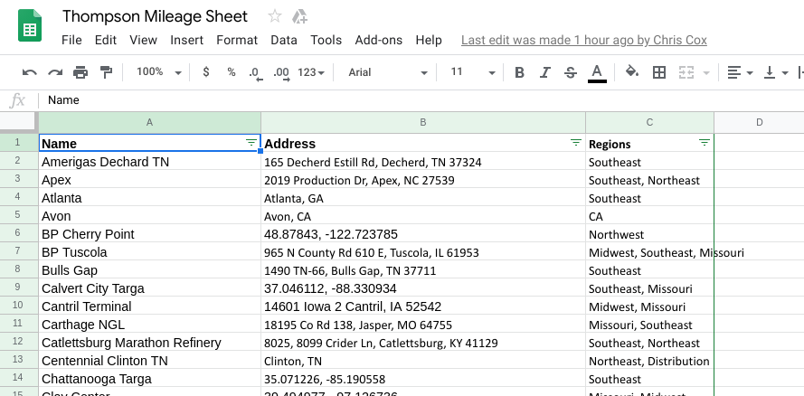
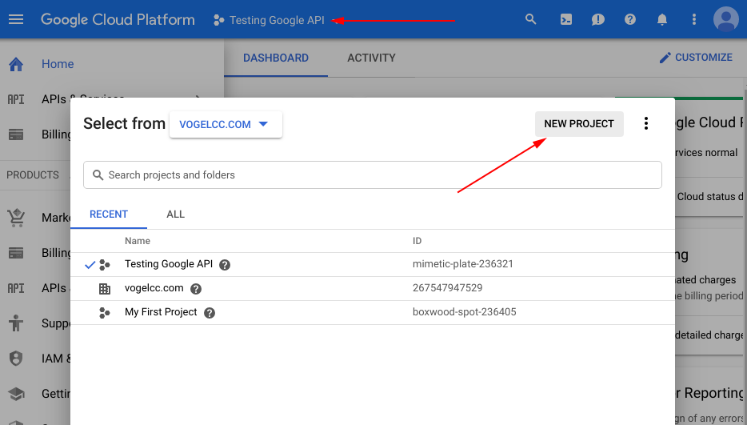
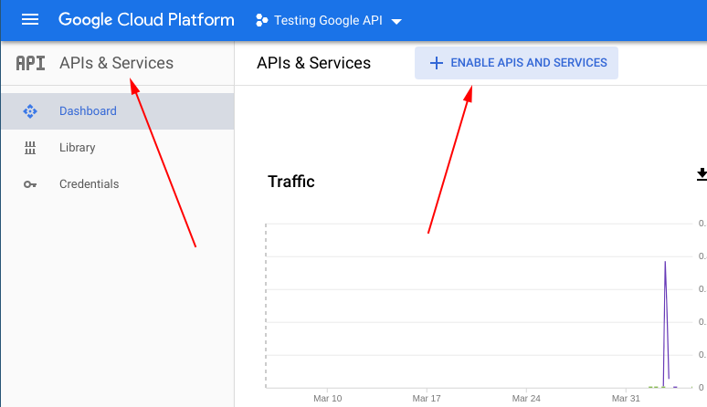
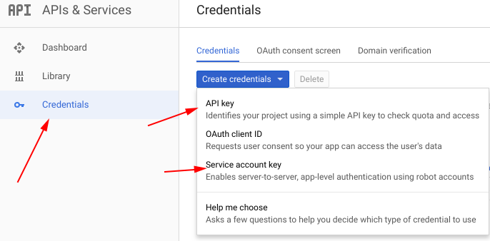

export { default as theme } from "./theme";
import { Split } from "mdx-deck/layouts";
import { Fragment } from "react";
import { Appear } from "mdx-deck";

# Lord of the Google Sheets

master google spreadsheets for good or for evil

#### by Jim Vogel

---

# About Me

- jim@vogelcc.com or @Jim on slack
- professionally coding for 10+ years
- python for 3 years
- I love to learn & try new stuff constantly
- problem solving enthusiast, feel free to talk to me

---

## Whats a google sheet?



** collaborative excel on the web! **

---

# Can python really control them?

- google-api-python-client
- gpread
- gspread_pandas

---

# Our goal today

1. read data from a google spreadsheet
2. do some processing on that data
3. dump results back to the spreadsheet

---

### Talking to google securely

- api key
- service account

---

### Authenticating to google (part 1)

#### setup the project

go here: https://console.cloud.google.com/



---

### Authenticating to google (part 2)

#### enable apis

- drive api
- sheet api



---

### Authenticating to google (part 3)

#### credentials!



---

### Setting up credentials

everyone is using dotenv now right?

```python
from settings import config
from oauth2client.service_account import ServiceAccountCredentials

scope = [
    "https://spreadsheets.google.com/feeds",
    "https://www.googleapis.com/auth/drive",
]

credentials = ServiceAccountCredentials.from_json_keyfile_name(
    config.google_credentials_file, scope
)

api_key = config.google_api_key

```

---

### Umm. can we talk to a spreadsheet yet?

```python
gc = gspread.authorize(credentials)
book = gc.open("Thompson Mileage Sheet")
wks = book.worksheet("Sheet1")

wks.update_acell('A1', "hello world")

print(wks.acell('A1').value)

```

---

# Demo

---

# Other things

I just want the data:

- gspread_pandas

I want to change to tab colors and formatting:

- google-api-python-client

---

## Where can you find more?

https://gspread.readthedocs.io/en/latest/  
https://developers.google.com/sheets/api/quickstart/python  
https://gspread-pandas.readthedocs.io/en/latest/

---

# Q & A

---

# Why this talk?

most people wanted applied things

next talk options:

- more applied stuff (webscraping)
- web stuff (react + hug)
- data science (k-means clustering)
- data visualization (mat plot lib)

---

# Thanks for listening!

- jim@vogelcc.com or @Jim on slack

I consult, teach, freelance, and geek out about python.

Shameless plug,
contact me if you need my services
